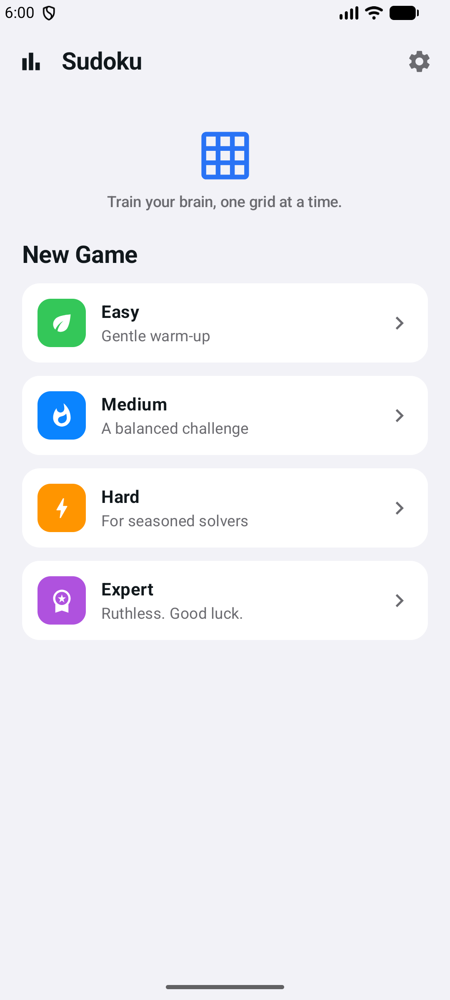
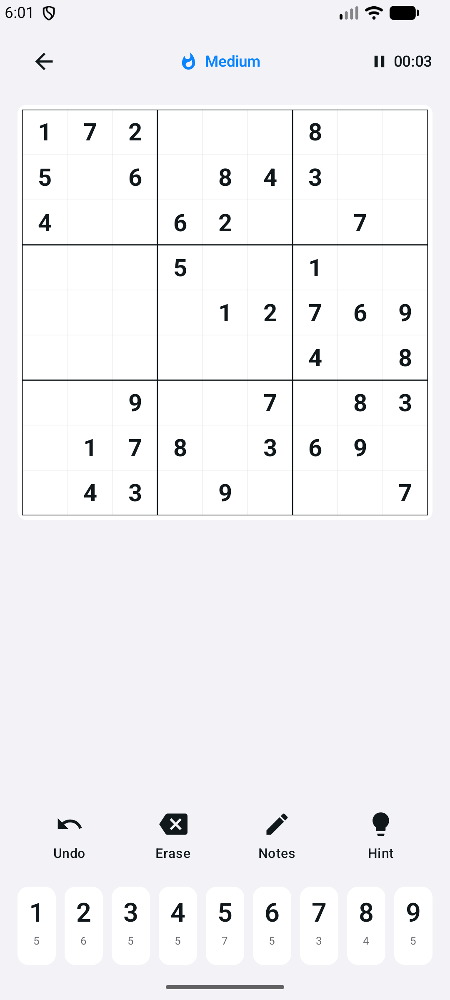
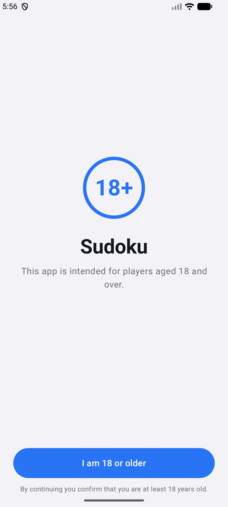

<div align="center">

# Sudoku — Android

[](https://kotlinlang.org)
[](https://developer.android.com/jetpack/compose)
[](https://developer.android.com/about/versions)
[](https://developer.android.com/about/versions)
[](#license)

**A clean, native Sudoku game for Android — on-device puzzle generation, four
difficulty levels, smart hints, pencil notes, scoring, and full offline play.**

Built with Kotlin · Jetpack Compose · Material 3

</div>

## Screenshots

| Home | Game | Age gate |
|------|------|----------|
|  |  |  |

## About

Sudoku is a faithful native port of the SwiftUI iOS app, rebuilt for Android with
Kotlin and Jetpack Compose to ship on the Google Play Store. Every puzzle is
generated on-device with a guaranteed unique solution — no puzzle database and no
network. The whole experience is private, offline, and ad-free.

### Features

- **On-device generation** — every puzzle has a guaranteed unique solution (MRV
  backtracking + 2-solution uniqueness check). No puzzle database, no network.
- **Four difficulties** — Easy (45 clues), Medium (36), Hard (30), Expert (25).
- **Real solving tools** — pencil notes, smart hints, conflict & same-number
  highlighting, auto-remove notes, undo/erase, optional 3-strikes mistake limit.
- **Scoring & stats** — speed/hint/mistake-based score, best times per difficulty,
  full game history, resume-in-progress.
- **Private by design** — 100% offline, no ads, no tracking, no permissions. Data
  never leaves the device.

## Tech Stack

| Layer | Choice |
|-------|--------|
| Language | Kotlin 2.0.21 |
| UI | Jetpack Compose + Material 3 |
| Architecture | MVVM — single `GameViewModel` (Compose snapshot state) |
| Persistence | SharedPreferences + kotlinx.serialization (JSON) |
| Build | Gradle 8.11.1 · AGP 8.7.3 · version catalog |
| Min / Target SDK | 24 / 35 (compileSdk 36) |

## Architecture

Lightweight MVVM. A single `GameViewModel` is the source of truth; the root
composable switches on an `AppScreen` enum instead of a NavHost.

```
┌─────────────────────────────────────────────────────────┐
│  UI (Jetpack Compose · Material 3)                        │
│  RootScreen → AgeGate · Home · Game/BoardView ·           │
│               Completion · Stats · Settings               │
└───────────────────────────┬─────────────────────────────┘
                            │ Compose snapshot state
┌───────────────────────────▼─────────────────────────────┐
│  GameViewModel  (board · timer · hints · undo · settings) │
└──────────┬──────────────────────────────┬───────────────┘
           │                              │
┌──────────▼──────────┐       ┌────────────▼───────────────┐
│  SudokuEngine        │       │  ScoreStore                 │
│  generate / solve /  │       │  SharedPreferences +        │
│  uniqueness (pure)   │       │  kotlinx.serialization JSON │
└──────────────────────┘       └─────────────────────────────┘
```

## Project Structure

```
app/src/main/java/com/tertiaryinfotech/sudokuapp/
├── MainActivity.kt              @main Activity; auto-pauses timer in onStop()
├── engine/SudokuEngine.kt       pure logic: generate / solve / uniqueness
├── model/                       Difficulty · GameSession · AppScreen
├── util/ScoreCalculator.kt      score = base + speed bonus − penalties
├── data/ScoreStore.kt           sessions + active game + stats (JSON)
├── viewmodel/GameViewModel.kt   board state, timer, hints, undo, 18+ gate
└── ui/                          theme + 7 Compose screens
store/                           Play listing copy, assets, privacy policy
```

See [CLAUDE.md](CLAUDE.md) for the full architecture map.

## Getting Started

### Prerequisites

- Android Studio (uses the bundled JBR — no system JDK required)
- An Android device or emulator (API 24+)

### Build & run

```bash
export JAVA_HOME="/Applications/Android Studio.app/Contents/jbr/Contents/Home"

./gradlew :app:assembleDebug        # debug APK -> app/build/outputs/apk/debug/
./gradlew :app:bundleRelease        # signed AAB for Play (needs keystore.properties)
```

Install & launch on a connected device/emulator:

```bash
export PATH=$PATH:~/Library/Android/sdk/platform-tools
adb install -r app/build/outputs/apk/debug/app-debug.apk
adb shell am start -n com.tertiaryinfotech.sudokuapp/.MainActivity
```

Or simply open the project in Android Studio (`File → Open`) and press **Run**.

## Deployment

Release signing, store-listing copy, graphic assets, and a complete Google Play
Console checklist live in [`store/`](store/). The release build is signed via a
git-ignored `keystore.properties` pointing at the Play upload key; enroll in Play
App Signing so Google manages the app key.

```bash
./gradlew :app:bundleRelease        # -> app/build/outputs/bundle/release/
```

## Contributing

1. Fork the repository
2. Create a feature branch (`git checkout -b feature/your-feature`)
3. Commit your changes (`git commit -m 'Add your feature'`)
4. Push to the branch (`git push origin feature/your-feature`)
5. Open a Pull Request

## License

Proprietary — © Tertiary Infotech Pte. Ltd. All rights reserved.

## Developed By

**Tertiary Infotech Pte. Ltd.**

## Acknowledgements

- A faithful port of the SwiftUI iOS edition, maintained as a separate codebase.
- Built with [Kotlin](https://kotlinlang.org), [Jetpack Compose](https://developer.android.com/jetpack/compose), and Material 3.

---

<div align="center">

**Train your brain, one grid at a time.** ⭐ Star the repo if you find it useful!

</div>
